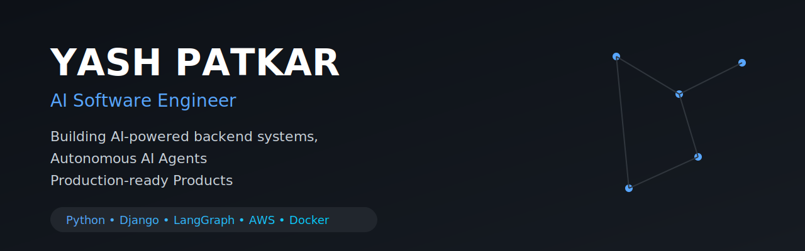

    

<h1 align="center">Hi 👋 I'm Yash Patkar</h1>

<h3 align="center">
AI Software Engineer • Backend Engineer • Product Engineer
</h3>

Building AI-powered backend systems, autonomous agents and production-ready software.

---

## 🚀 About Me

I'm a Backend Engineer currently working on AI-powered products.

I enjoy building production-grade backend systems, AI agents, internal developer tools, APIs and scalable software.

### Current Focus

- 🤖 AI Agents
- 📚 Agentic RAG
- ⚙️ Backend Architecture
- ☁️ AWS
- 🐳 Docker
- 🚀 Production Systems

---

## 🛠 Tech Stack

### Languages

Python • SQL • JavaScript • Bash

### Backend

Django

Django REST Framework

FastAPI

### AI

LangChain

LangGraph

OpenAI

Claude

Model Context Protocol (MCP)

### Infrastructure

PostgreSQL

Redis

Docker

AWS

Linux

GitHub Actions

---

## 💼 Experience

**Junior Backend Engineer**

Working on production AI-powered software using Python, Django, REST APIs and modern AI frameworks.

---

## 🚀 Featured Projects

Coming Soon...

---

## 📈 GitHub Stats

Coming Soon...

---

## 📫 Connect

Portfolio

LinkedIn

Email
